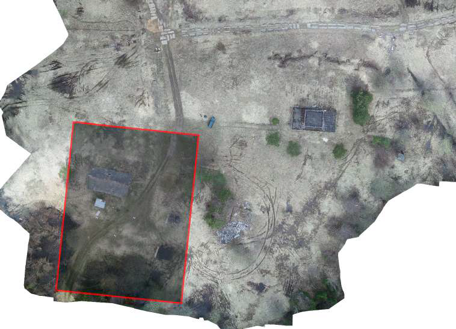

# Привязка аэроснимков к местности

  

## Цель работы
В современном мире огромное количество задач решается с помощью спутниковых фотографий и аэрофотоснимков. Зачастую от скорости и качества интерпретации этих данных зависит то, как быстро выявляются пожары, наводнения и другие чрезвычайные ситуации. Технологии машинного зрения только начинают применяться в решении такого рода задач, однако потребность в их использовании постоянно растет. 
Решение данной задачи позволит оперативно привязывать изображения к географическим координатам, что в дальнейшем может ускорить геодезические работы, поможет оперативно искать пропавших людей, контролировать вырубку лесов. И это только краткий список того, где требуется привязка аэрофотоснимков к местности.

## Решение
Решена задача регрессии с использованием модели NFNet (Normalization Free Net) с ECA (Efficient Channel Attention) и функцией активации SiLU.  
Обучение производилось при помощи Google Colab с использованием видеокарты Tesla P100.

## Результаты
[Aerial-Template-Matching](Aerial-Template-Matching.ipynb) - ноутбук с исследованием, обучением и предсказанием. Также ноутбук доступен на [Google Colab](https://colab.research.google.com/drive/1JZnJp6bcbG8BMbGzpXUTQJvEMM0BrlPn) с дополнительной подготовкой окружения специально для Google Colab. 
Веса обученных моделей и история их обучения находятся в разделе [Github Releases](https://github.com/slavabarkov/aerial-template-matching/releases) а также доступны на [Google Drive](https://drive.google.com/drive/folders/15Z4e4rc83Atsfd3k3YG3peeEpn7Tkdcg).
